# Introduction

The present task's main objective is to develop and test an *MQTT Broker* based on the MQTT (Mosquitto) protocol. 

Thus, the student must run the Mosquitto service in the BeagleBone to create the Broker. Then, an ESP32 client must publish the temperature data logged by a sensor. Furthermore, the Node-RED App should be used as a client to show the data as a Graphical User Interface from the ESP32 client. 

Finally, the student must implement a basic **Alarm** indicator that turns ON when the temperature exceeds a limit value or remains OFF if the value is lower.


# Technical Report (Readme file)

The students must consider presenting a detailed document that includes:

- MQTT Broker installation and configuration 
- ESP32 client connection (schematics) and programming code with detailed explanation
- Node-RED installation, configuration, and views

# Mosquito 

## Instalación y activación
En caso de que no se tenga instalado `Mosquito` en la BeagleBone Black, se deben realizar los siguientes pasos: 
- Actualizar los paquetes: 
```
sudo apt update
sudo apt upgrade
```
- Instalar Mosquitto: 
```
sudo apt install mosquitto
```

Una vez instalado, para iniciar el servicio se debe de ingresar el siguiente comando: 
```
sudo systemctl enable mosquitto.service
```

Se puede saber si el servicio se activó correctamente ingresando el siguiente comando, debe de aparecer la leyenda `Running`, como se muestra en la imagen. 
```
sudo systemctl status mosquitto service
```
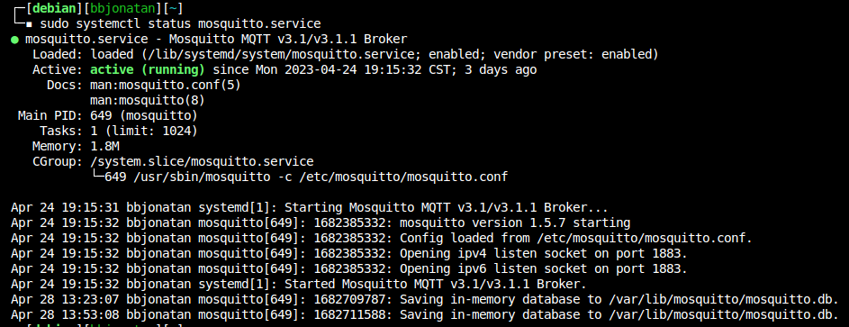

## Configuración

Se pueden modificar ciertos apartados der servicio, como que se mantenga activado el servicio, el puerto en el que se corre, el archivo de contraseña, entre otras funciones.

Para cambiar la configuración que viene por defecto se debe de cambiar el archivo `mosquitto.conf`, lo cual se puede hacer descargando el archivo mosquitto.conf que viene en este repositorio y copiándolo a la ubicación correspondiente con el siguiente comando: 
```
sudo cp ./mosquitto.conf /etc/mosquitto/mosquitto.conf
```
Esto suponiendo que se esté en la carpeta donde se descargó el archivo. 

Otra manera es creando un archivo con el nombre `mosquitto.conf` con el siguiente contenido: 
```
persistence true
listener 1883
persistence_location /var/lib/mosquitto/
connection_messages true
allow_anonymous true
password_file /etc/mosquitto/passwd
```
Después de guardarlo, se debe copiar con el comando que se mostró anteriormente. 
 
Ahora se debe crear el archivo que contenga la contraseña, el cual se indicó en el archivo `mosquitto.conf`, si no se quiere colocar una contraseña, se puede seguir el siguiente comando: 
```
sudo touch /etc/mosquitto/passwd
```
Si se le quiere colocar una contraseña, se puede crear el archivo con el nombre `passwd` en donde se coloque la contraseña y luego copiarlo con el siguiente comando: 
```
sudo cp ./passwd /etc/mosquitto/passwd
```

Fimalmente, para aplicar los cambios se debe reinicar el servicio: 
```
sudo systemctl restart mosquitto
```

## Prueba del servicio

Para probar si el servicio se configuró de forma correcta, se puede descargar `MQTT X`, que es una aplicación disponible para Windows, Linux y MacOS que permite conectarse como cliente, se puede descargar de la página `https://mqttx.app` o con el siguiente comando en Linux: 
```
sudo snap install mqttx

```
Una vez instalado, en la interfaz de debe de presionar el símbolo `+` y se abrirá la pestaña que se muestra en la imagen, entonces se debe de llenar los apartados, en `Name` el nombre de la conexión, en la parte derecha de `Host` se debe colocar la IP de la BeagleBone Black, si no la sabe la puede ver en la terminal tecleando `ifconfig`, en la parte de `Port` se debe colocar el puerto en el que está corriendo el servicio, para nuestro caso es el 1883. ***Importante. Se debe de cambiar la versión de MQTT a la que se tenga instalada, para nuestro caso es la 3.1.1***

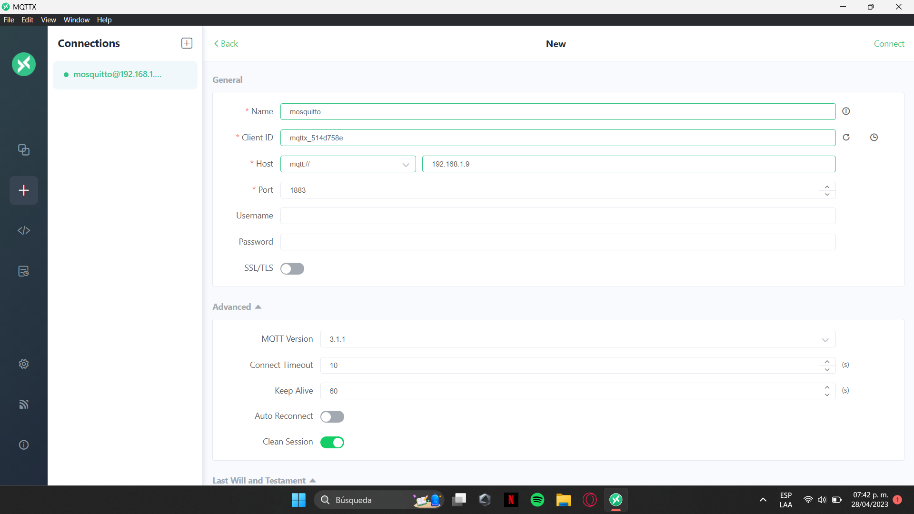

Una vez llenados los datos, se le da a conectar y llevará a la pantalla que se muestra en la imagen, donde ahora se debe de presionar `New Subscription`, se le coloca un nombre, para este caso se le colocó `test`. En la parte inferior de la pantalla aparece un símbolo para enviar un mensaje, se pueden de enviar diferentes tipos de datos (se pueden visualizar en la parte de Payload) como JSON, entre otros; para este caso se usará `Plaintext` y debajo debe de asegurarse que esté colocado el nombre la subpcripción que se creó. Finalmente, se escribe el mensaje y se presiona el símbolo de la parte inferior derecha y se debería de recibir de vuelta el mismo mensaje, como se observa en la imagen, lo que indica que el servicio está funcionando y los dispositivos pueden conectarse con la BeagleBone a través de MQTT. 

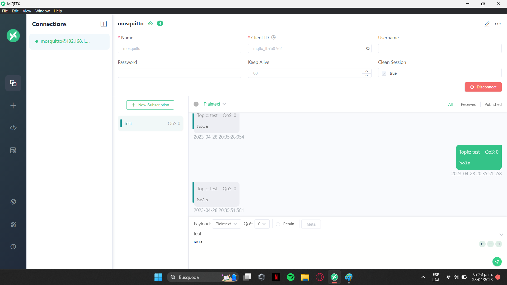

# Node-Red

## Instalación
Antes de instalar Node-Red, se requiere `nodejs` y `npm`, los cuales se instalan con los siguientes comandos: 
```
sudo apt update
sudo apt install nodejs
sudo apt update npm
```

Lo siguiente es la instalación de Node-Red a través de `npm` con un `--unsafe-perm` para instalar a pesar de que Node-Red indique que requiere una versión más reciente de nodejs: 
```
sudo npm install -g --unsafe-perm node-red
```
Luego se debe instalar el panel de Node-Red con los siguientes comandos: 
```
node-red-stop
npm install node-red-dashboard
```
## Activación 
Ahora es necesario poner en funcionamiento Node-Red en segundo plano y visualizar si se activó de forma correcta: 
```
node-red &
sudo netstat -plnt
```
En caso de que aparezca un mensaje diciendo que el puerto está en uso, como se muestra en la imagen, se deberá presionar `ctrl+c`, el puerto por defecto es el 1880, pero se puede colocar otro puerto, por ejemplo, el 1885:
```
node-red -p 1885 &
```
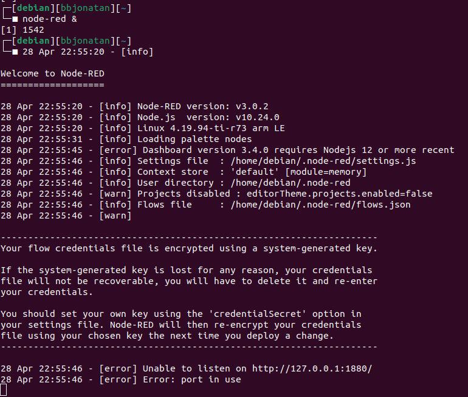

Si el puerto no está en uso deberá de aparecer algo parecido a lo que se muestra en la imagen, además se puede observar que se conecta directamente con el servidor MQTT que está corriendo en el puerto 1883. 

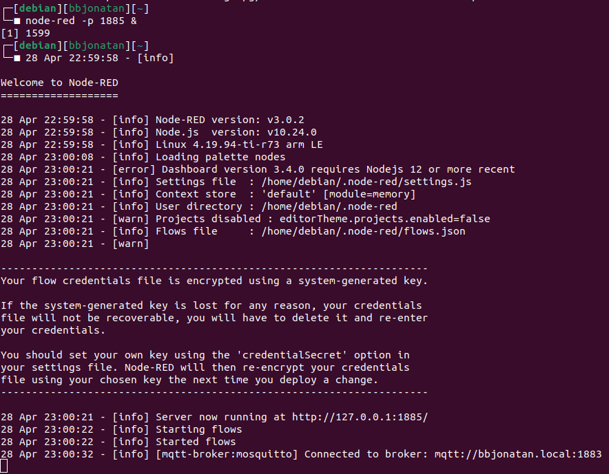

## Prueba de conexión de MQTT y Node-Red

Para ver el panel de Node-red, en el navegador de la computadora se debe acceder a `Nombre-IP_Host:1885`, en este caso se accedió con `192.168.1.200:1885`, lo cual nos lleva a la pantalla que se muestra en la imagen. 

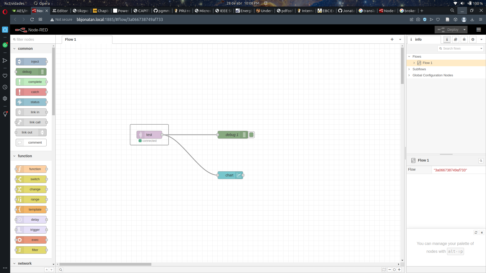

Para comprobar que Node-Red y MQTT están conectados de forma correcta, se utilizaron los siguientes nodos que se pueden encontrar en la parte izquierda del panel de Node-Red:
- `mqtt in` que se encuentra en network.
- `debug` que se encuentra en common. 
- `chart` que se encuentra en dashboard. 

Como se acaban de colocar, aparecerá un triángulo rojo encima de los nodos, lo que indica que no están configurados, como se muestra en la imagen. 

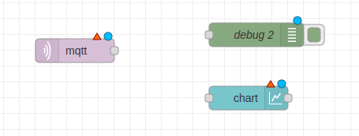

Para configurarlos solamente es cuestión de dar doble click al nodo. La primer configuración será del nodo `mqtt in`, la configuración aparecerá como se muestra a continuación, la cual es muy parecida a la hecha en MQTTX, en server colocamos `mosquitto`, en topic colocamos `test` y en output colocamos `a String`, como se muestra en la imagen. 

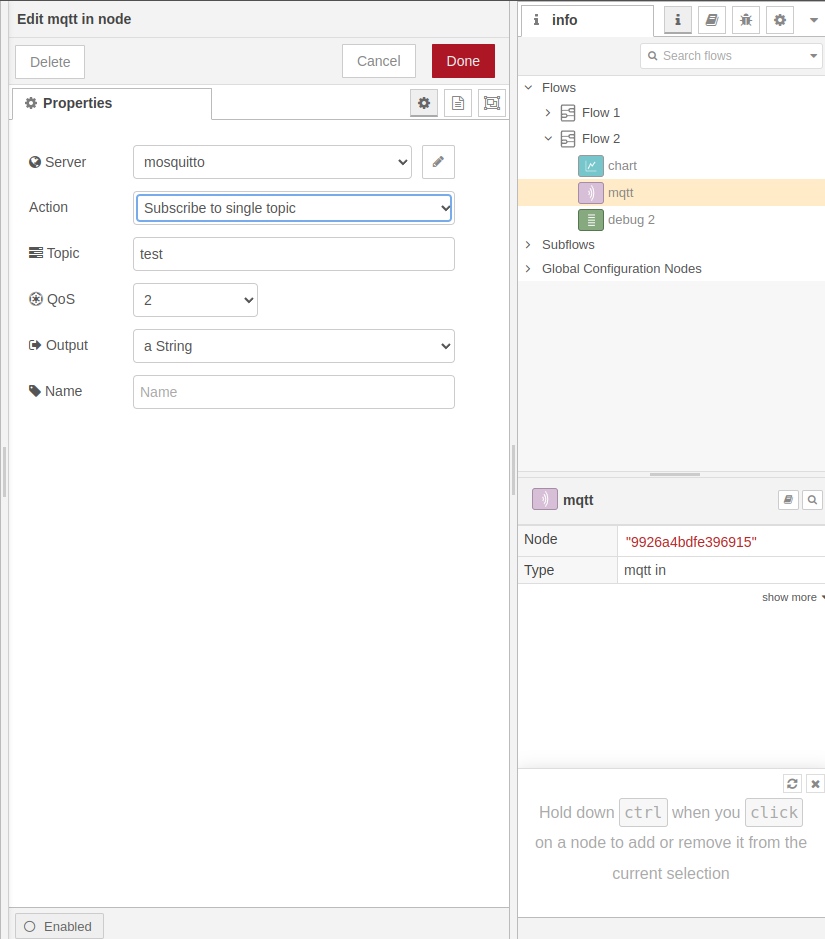

Después es necesario dar click en la imagen del lapiz que está en la parte derecha de server, lo cual lleva a la configuración del servidor MQTT al que se conectará. En name colocamos `mosquitto`, en server colocamos la dirección IP de la BeagleBone, en este caso es `192.168.1.9`, en port colocamos el puerto en el que se esté corriendo mosquitto, en este caso es el `1883` y en protocol seleccionamos `MQTT V3.1.1`, en la imagen se muestran los campos llenados con lo descrito anteriormente. 

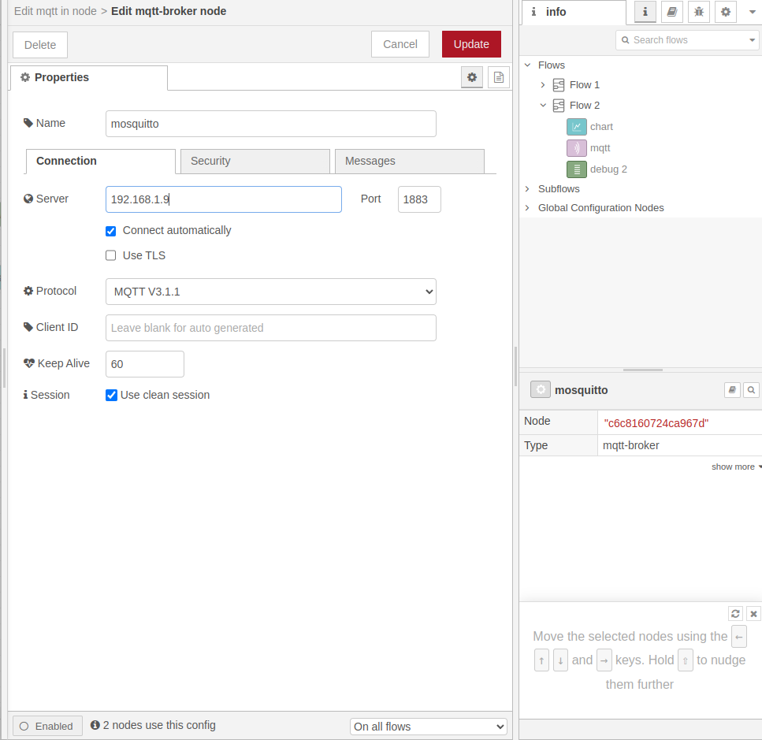

Se debe de presionar el botón `Update`, lo cual regresará a la ventana de la primera configuración y luego se debe de presionar `Done`, lo cual debe de quitar el triángulo rojo del nodo, en caso contrario, la configuración no se realizó de forma correcta. 

El siguiente nodo a configurar es `chart`, el cual es muy sencillo, ya que no debemos cambiar ninguna de las configuraciones, solamente debemos de dar click en el lapiz que está a la derecha de Group, en la ventana a la que lleva presionar `Update` y luego `Done`, con esto se debe de quitar el triángulo rojo del nodo. 

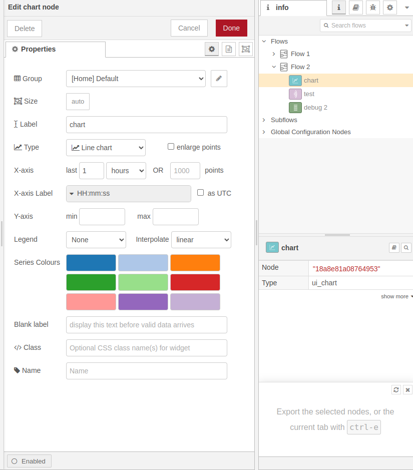

Luego de que todo esté configurado, la última parte es conectar los nodos, lo cual es muy sencillo, al acercar el ratón a los pequeños cuadrados que se encuentran a los lados de los nodos se iluminarán de color naranja, damos click y solamente es cuestión de arrastrar hasta el nodo al que se quiera conectar, para esta prueba, las conexiones quedaron como las que se muestran en la imagen. 

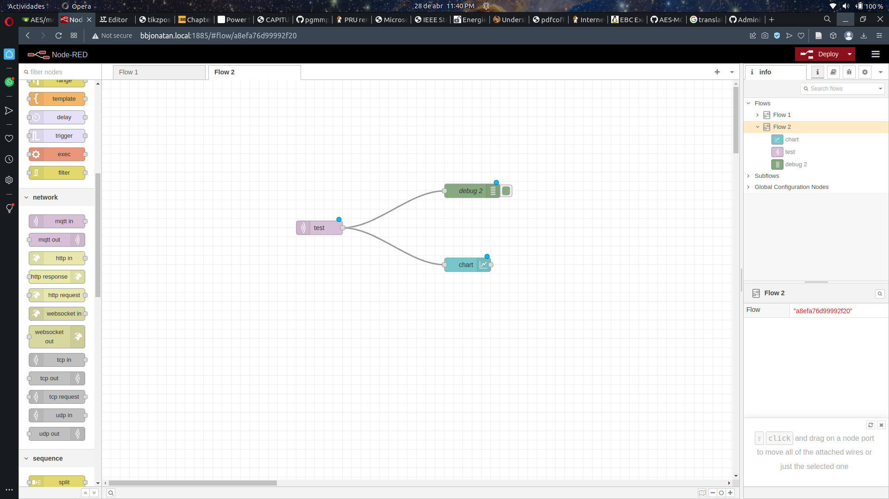

La prueba final para saber si todo funciona correctamente es entrar a la dirección `192.168.1.9:1885/ui` donde nos deberá aparecer lo que se muestra en la imagen. 

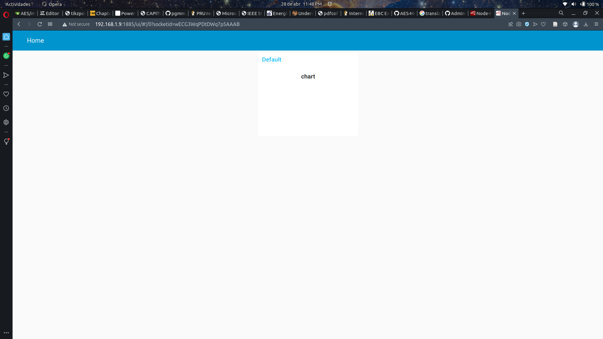

Y finalmente, desde MQTTX enviaremos varios números, si todo está bien, se deberían de graficar los valores conforme se envían, como se muestra en la imagen. 


# ESP-32

## Arduino IDE
Para llevar a cabo la prgramación del ESP-32 se usará Arduino IDE, el cual se puede descargar desde la tienda de aplicaciones de Windows, Ubuntu o MacOS, o desde la página oficial https://www.arduino.cc/en/software.

## Antes de programar el ESP-32 

Para que Arduino IDE pueda compilar el programa y subir la información a la ESP-32, primero es necesario descargar el gestor de placas de la ESP-32, para eso se debe ir a `Herramientas -> Placa -> Gestor de tarjetas`, lo cual llevará a una ventana como la que se muestra en la imagen, donde solamente se debe buscar `ESP32` y el gestor a instalar es el creado por `Espressif Systems`.

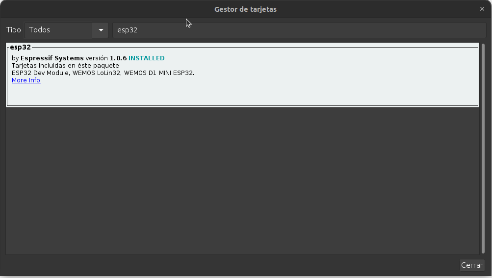

En caso de que no aparezca el gestor mencionada, se deberá ingresar a `Archivo -> Preferencias`, lo cual llevará a una ventana como la que se muestra en la imagen, en el apartado de `Gestor de URLs Adicionales de Tarjetas` se deberá copiar el siguiente link https://dl.espressif.com/dl/package_esp32_index.json y oprimir Ok. Después es necesario volver a buscar en el gestor de tarjetas `ESP32`. 

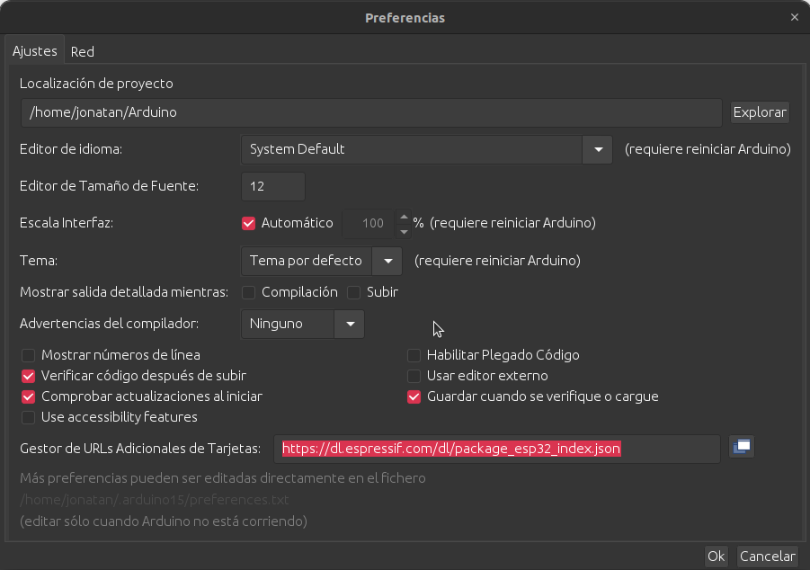

El siguiente paso es instalar la librería `PubSubClient`, para ello debemos de ir a `Programa -> Incluir Librería -> Administrar Bibliotecas`, en donde debemos de buscar PubSubClient e instalar la creada por `Nick O'Leary`.

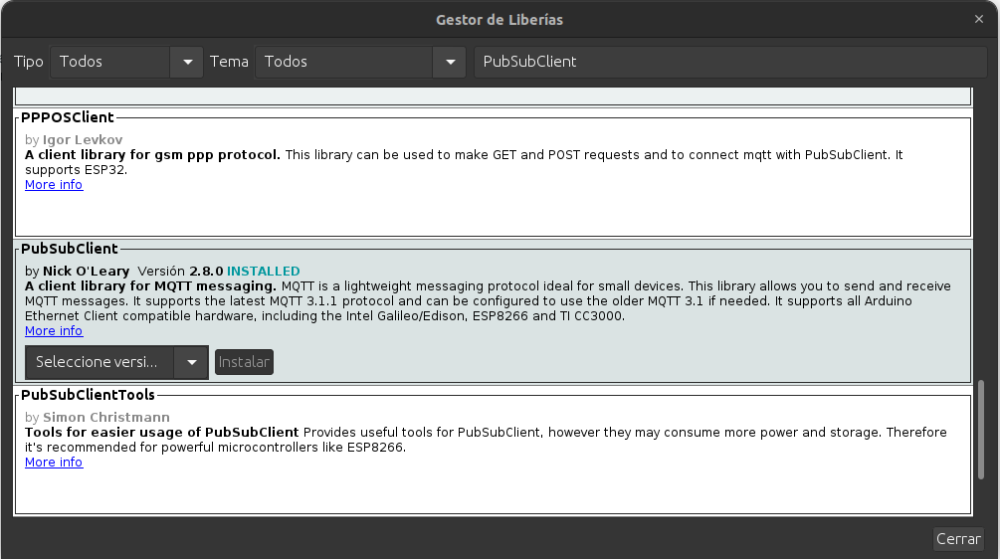

## Prueba de Node-Red, MQTT y ESP-32

En el repositorio se encuentra el archivo `mqtt.ino`, en el cual se conecta al servidor MQTT que se encuentra en la BeagleBone y le envía el valor leído por el ADC del pin 34 de la ESP-32 cada 5 segundos. Para esta prueba se usó la versión del ESP-32 que se muestra en la imagen.

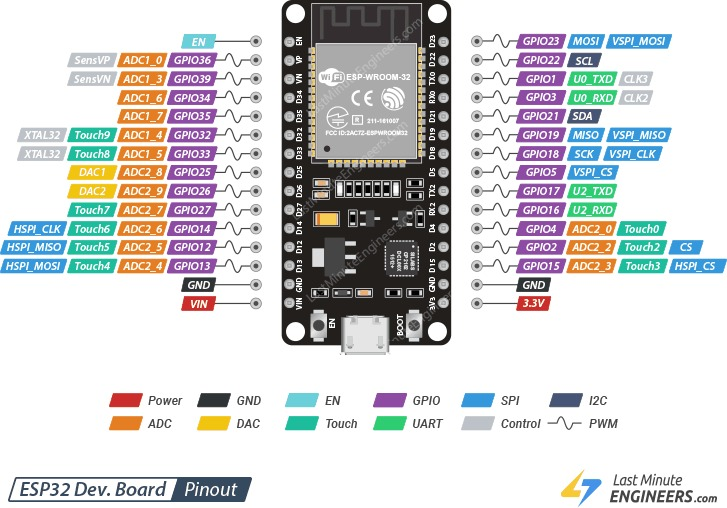

En el código, las partes importantes a modificar son dos, la primera corresponde al nombre y contraseña de la red inalámbrica que se va a conectar la placa, lo cual se debe de colocar en `ssid` y `password`. La segunda parte a modificar son del servidor MQTT, en `mqttBrocker` se debe colocar la dirección IP de la BeagleBone (192.168.1.200 en este caso), en `topic` se debe colocar `test`, en `mqttUsername` se puede colocar cualquiera, como no se colocó contraseña, `mqttPassword` se queda vacío y en `mqttPort` se coloca `1883`.


Una vez modificado el código, se debe conectar la ESP-32 a la computadora y verificar los siguientes apartados: 
- Ir a `Herramientas -> Placa -> ESP32 Arduino` y ahí seleccionar `DOIT ESP32 DEVKITV1`. 
- Verificar que `Upload Speed` se encuentre a 921600. 
- En `Puerto`, se debe de seleccionar en el que está conectado el ESP-32, en caso de que no sepa cúal es, se puede conectar y desconectar para rápidamente identificar el puerto. 

Una vez hechas las configuraciones, solamente queda presionar el botón de subir, el cual es un símbolo de una flecha apuntando a la derecha `->`, con lo que se compilará el archivo y se empezará a subir. En dado caso de que aparezca un mensaje de conectando en la parte inferior de la pantalla, se deberá presionar el botón de `boot` de la ESP-32 hasta que se comience a subir, para la placa usada en esta prueba no es necesario que se presione el botón. Una vez subido el programa se mostrará un mensaje como el que se muestra en la imagen. 

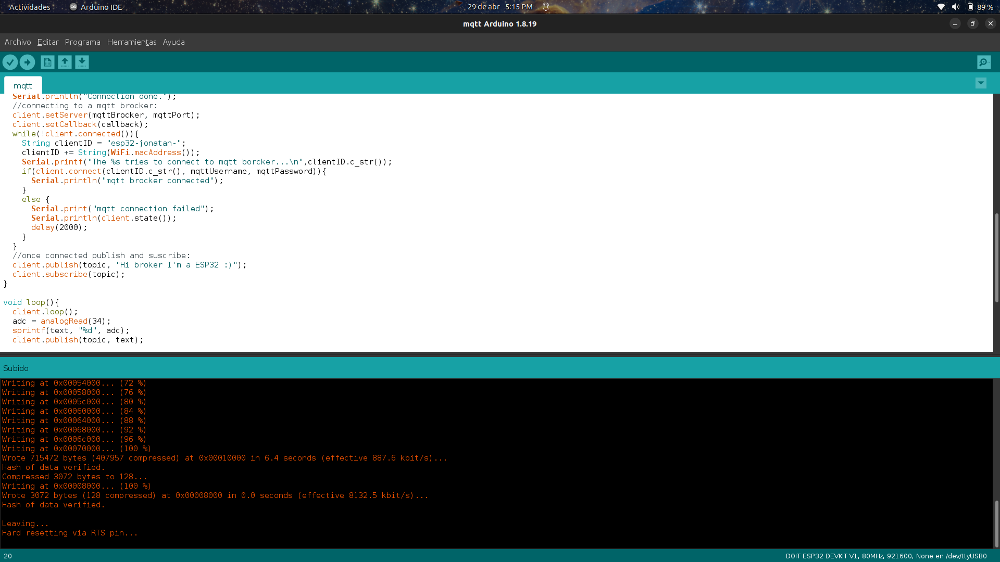

Una vez subido, se puede abrir un monitor serie (***Asegurarse que la velocidad está en 115200 baudios***) para ir observando los mensajes que se envían al servidor MQTT e ingresar a la dirección `192.168.1.200:1885/ui` en el navegador, donde se podrán observar las mediciones que se van registrando en el ADC en una gráfica, como se muestra en la imagen.  

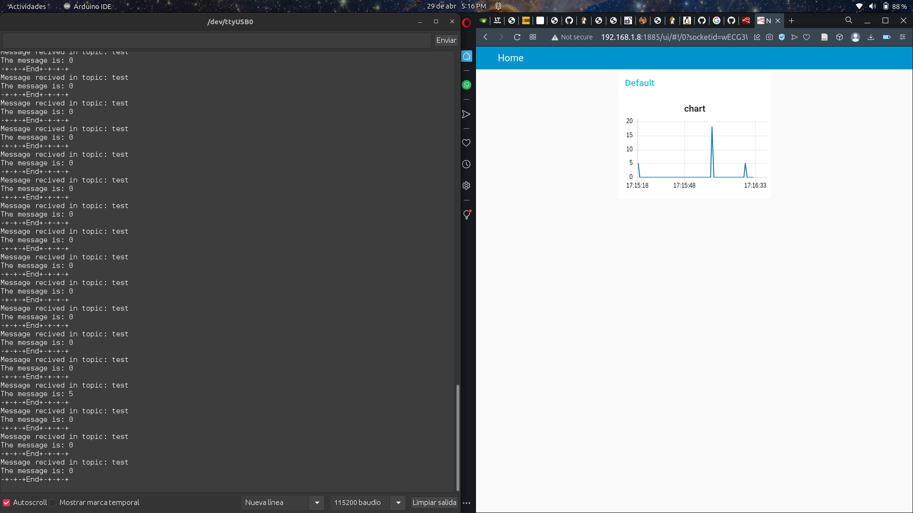

